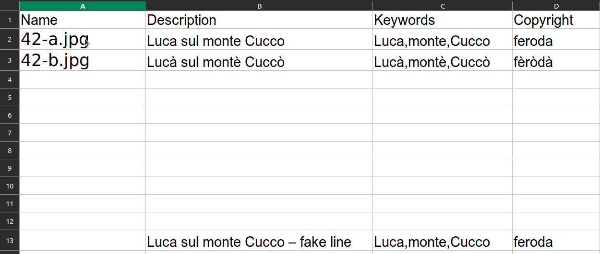
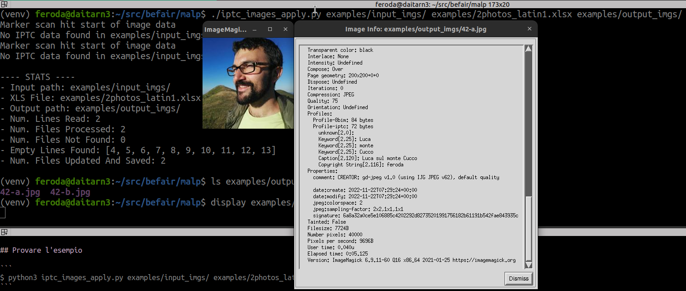
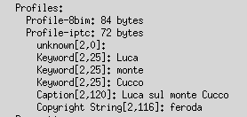
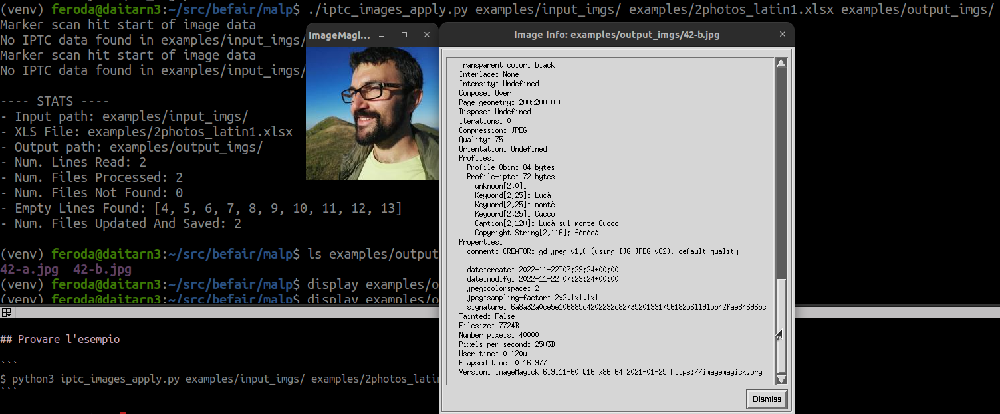
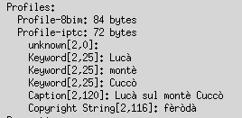

# Photo Metadata Updater

Lo script prende in ingresso/input: 

- il percorso della cartella con le immagini da processare
- il percorso del foglio di calcolo che contiene i metadati
- [opzionalmente] il percorso della cartella in cui verranno copiati i file processati (se non esiste viene creata)

Se non viene specificato il terzo parametro,
lo script visualizza a video i metadati che avrebbe inserito.

Per ogni immagine nella cartella, lo script: 

- legge dal foglio di calcolo i metadati da applicare
- se esistono, crea una copia dell'immagine nella cartella di destinazione con i metadati applicati
- stampa un report di quanti file sono stati processati

Esempio file .xls o .ods:

```
Name	Description	Keywords	Copyright Notice
62507-c.jpg;Rare and endangered trees unique to China, 1958;Rare , endangered, trees ,unique, plants, botany, wildlife, China, 1958, 1950s;	Colaimages
```

## Eseguire

Richiede Python>=3.6

```
$ pip3 install -r requirements.txt
$ python3 iptc_images_apply.py input_imgs myxlsfile.xls output_imgs
```

## Provare l'esempio

```
$ python3 iptc_images_apply.py examples/input_imgs/ examples/2photos_latin1.xlsx examples/output_imgs/
```

### File xls 2photos_latin1.xlsx




### 42-a.jpg

Il mio avatar sul Monte Cucco processato



I tag IPTC scritti nella foto



### 42-b.jpg

Il mio avatar sul Mòntè Cuccò processato con accenti



I tag IPTC scritti nella foto


